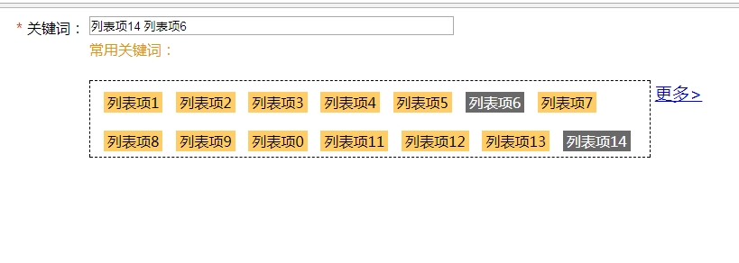

# click-input的实现

照例不知道这个功能叫什么名字好，姑且取名叫做click-input。事实上这是公司的一个项目，我司的后台管理面板都是后端在处理，他们在做一个关键词选择的时候，想要实现一些更丰富的效果，所以我做了这个东西。

预览图：



## 实现的功能

打开页面时，关键词的input框中已有的内容，如果‘常用关键词’中也有，就会切换到选中效果

更新关键词input框中的内容时，如果手动输入的关键词符合‘常用关键词’中的列表项，也会切换到选中效果；如果删除这个关键词或者其他符合的关键词，‘常用关键词’中的选中效果也会发生相应的改变

点击‘常用关键词’中的列表项，会将其添加到‘关键词’input框中

列表项超过10个，初始状态只显示两行。点击‘更多’按钮后，展开所有的列表项

## 实现思路

依赖JQurey。

事件驱动，对不同的功能分别进行处理。实现一个公共的函数`renewKeywords();`，用来处理input中的内容和列表中选中内容的同步。

```javascript
    function renewKeywords() {
        var keyWord = document.getElementById('keyWords').value;
        var keyWords = keyWord.split(' ');
        $('.keywords li').removeClass('active');
        texts = [];
        for(var i = 0;i<keyWords.length;i++){
            for(var j = 0;j<liKeyWords.length;j++){
                if(keyWords[i] == liKeyWords[j]){
                    texts.push($('.keywords li')[j].innerText);
                    $($('.keywords li')[j]).addClass('active');
                    break;
                }
            }
        }
    }
```

这个函数会多次用到。

首先获取input框里的内容，然后将内容保存为一个数组。先移除所有列表项的选中状态，通过遍历对所有的列表项进行比较，给所有选中的项目设置选中状态。

这就是这个函数的基本功能。

### 1.input框

```javascript
    $('#keyWords').bind('input propertychange', function() {
        renewKeywords();
    });
```

貌似IE和其他浏览器的处理不同。但使用JQurey的话，只需要绑定input事件和propertychange，每一次input中内容的改变都会触发这个事件，然后调用`renewKeywords();`这个函数。

输入内容后同步状态的功能完成。

#### 初始状态同步

input中的内容在打开页面时不总是空的，所以还需要实现一个初始状态同步的功能，打开页面时把input中的内容同步到列表项中的选中状态；

```javascript
    var liKeyWords = [];
    for(var i = 0;i<$('.keywords li').length;i++){
        liKeyWords.push($('.keywords li')[i].innerText);
    }//遍历li标签，保存innerText到数组中
    
    /*初始化已经选中的项目*/
    renewKeywords();
```

这里通过一个数组，遍历列表中的内容，之后调用`renewKeywords()`方法，就完成了初始化选中状态的功能；

### 2.‘更多’按钮的实现

```javascript
    /*‘更多’按钮*/
    if($('.keywords li').length>10){
        $('#more_button').show();
    }//li多于10个才显示‘更多’按钮
    $('#more_button').on('click',function () {
        $('.keywords ul').css('height','auto');
        $('#more_button').hide();
    })//点击后隐藏
```

实现思路是把按钮先写在html中，设置`display:none;`。另外为列表的高度设置为3行字符内，同时`overflow:hidden`。

这样就实现了隐藏过多内容的功能。

展开列表项：判断列表项超过10个，调用JQurey的.show()方法显示‘更多’按钮；点击‘更多’按钮后，通过设置列表的高度为`auto`，去除了对列表的高度限制，列表也自然是展开状态了。

‘更多’按钮的功能完成。

### 点击列表项添加到input中的功能

```javascript
    /*点击li后，添加到input中，同时应用选中样式*/
    $('.keywords li').on('click',function () {
        var li = $(this),
            text = this.innerText;
            texts = document.getElementById('keyWords').value.split(' ');
        for(var i = 0;i<texts.length;i++){
            if(text === texts[i]){
                texts.splice(i,1);
                liTexts = texts.join(' ');
                $('input[name=keyWords]').css('width',5*texts.length+'em');
                li.removeClass('active');
                document.getElementById('keyWords').value = liTexts;
                return;
            }
        }
        $('input[name=keyWords]').css('width',5*texts.length+'em');

        texts.push(text);
        liTexts = texts.join(' ');
        li.addClass('active');
        document.getElementById('keyWords').value = liTexts;
    })
```

为所有的列表项绑定点击事件，这是基本的操作。

思路是先获取input中已有的内容，转换为数组，将点击的内容push到数组中，然后将数组中的内容更新到input中。

这里还有一个点击已选中的列表项将其设置为未选中状态的功能需要先处理。也是通过循环，对每一项进行对比，如果是选中状态，则从数组里移除这一项，同时设置其为未选中状态。将新的数组内容设置为input框中的内容，然后通过`return`直接结束掉这一次点击事件。

如果没有选中，则进行正常的流程。push列表项的内容到数组中，改变选中状态，设置input框中值。

### One more thing

可以在这里看demo：[click-input](https://life1st.github.io/commonJS/click-input/index.html)

整个功能的实现就是这样了。100行代码不到，功能很简单，但是自己感觉还有提高的空间。比如循环用的太频繁是不是会影响性能，应该怎样改进？是否有更好的实现方式？

目前实习时间两个月，还有很多需要学习的地方。比如想封装一些基础小功能的库，是否用闭包会更好？

最后，感谢阅读！

同步在sf.gg：[点击这里](https://segmentfault.com/a/1190000011091404)