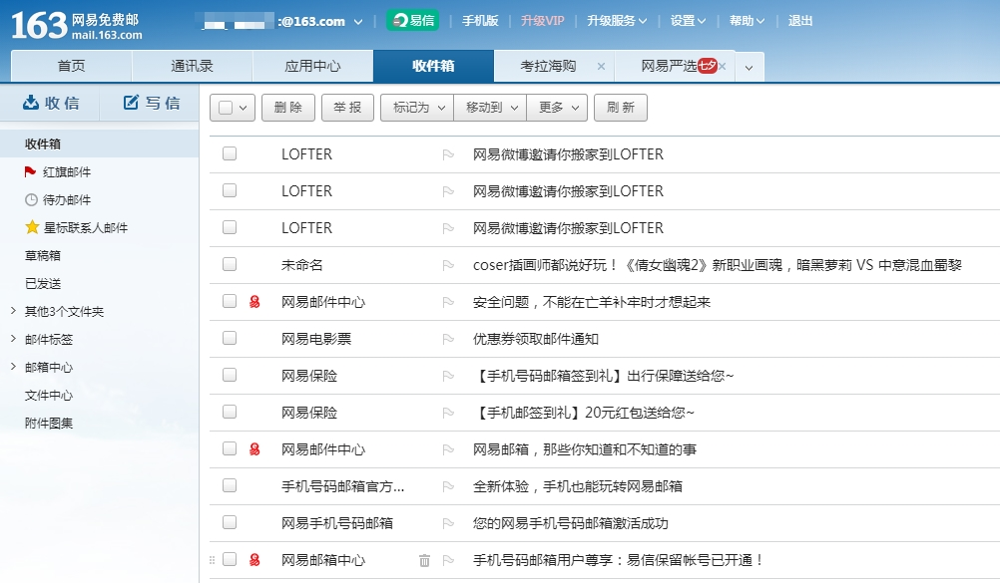

# tab-UI

不知道叫什么名字好，暂且称为tab-UI吧，简单来说就是在网页里实现了一个类似chrome的标签栏，可以通过点击切换不同的内容，或者说类似`网易邮箱`的效果。
> 网易邮箱截图：



下面记录一下遇到的问题和学到的东西。

## CSS

### 1.设置过渡(动画)

`transition:<属性> <时间>;`

为`<属性>`设置过度动画

> example：
```css
    .menu-li{
        border-radius: 5px 2px 0 0;
        transition: border-radius .2s;
    }
    .menu-li:hover{
        border-radius: 15px 15px 0 0;
    }
```
这样，标签在鼠标移入和移出的时候`border-radius`就会自动应用一个0.2s的过渡动画。

> 一开始使用`@keyframes`设置动画，但是在当前需求下代码比较繁琐，需要为移入移除分别进行设置,所以尝试后放弃了这个方案。

### 2.扩大按钮热区

知识点来自`《CSS揭秘》`，前几天看到这个魔法，现在正好用上。

由于关闭按钮太小，如果不进行处理难以点击，非常影响体验，所以需要扩大响应区域。

原理是通过设置透明的边框扩大元素在文档中占的位置，达到在“视觉边缘”点击（其实已经在元素上了）就可以响应的效果。另外，设置的:hover伪类也可以对状态进行提示，背景色改变的时候就一定是在关闭按钮上，即使手抖一下移动了一点也没有影响，很好的提高了用户体验。


> example:

```css
    .close-button {
        border: 5px solid transparent;
        background-clip: padding-box;
    }
    .close-button:hover {
        background-color: #194C7B;
        color: #FFF;
        cursor: pointer;
    }
```

需要注意的是，一定要设置`background-clip`为`padding-box`,否则背景会扩大到边框区域，造成按钮变大的效果。

另外，如果要设置边框，可以使用`box-shadow`来模拟。

> example:

## JS

这是实现功能的原理和思路。

关键点是要为侧边栏、tab栏和内容区建立联系，达到某一个组件状态改变了可以被其他组件接收到。

所以在这里我为三个（姑且称为组件）应用了一个同样的`key`来建立他们之间联系。

这个`key`就是一个数组，通过便利侧边栏内的标签，为所有标签应用上一个字符串和`key`拼接起来的ID,达到通过点击事件获取`key`的值，改变剩下的两个组件的作用。


### 阻止事件冒泡和默认事件

#### `event.preventDefault()`

#### `return false;`

由于层级关系：`body > ul > li > .close-button `,点击任一位置都会导致事件向上冒泡，所以在代码逻辑结束时使用`return false`来阻止事件冒泡和默认行为。
>需要注意的是，在JQuery方法里使用`return false`可以同时阻止事件冒泡和默认行为，在原生Js里只阻止默认行为（来源于网络博客文章，未亲自证实）。另外使用该方法可能会出现未阻止事件和行为的灵异事件（同样未证实）。

## One more thing.

这篇文章和这个功能的实现目前还有很多不够完善的地方，处理方法也比较原始。这个一是因为我的水平有限，二是项目是一个久经维护的老项目，而且还是采用的vm模板（一个使用Java处理的前端模板），所以很多东西不方便动。想法是把这个功能抽离出来作为一个库使用，说不定什么时候会做这个事。