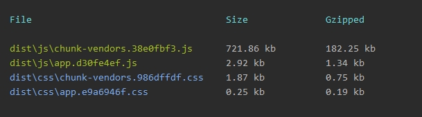
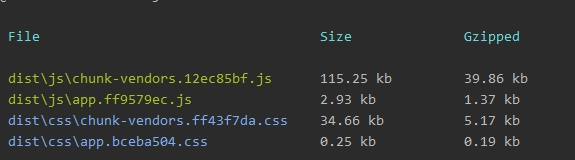

# 基于 Vue 的后台管理系统前端实践

[TOC]

## 初始化项目

使用 Vue-cli3 初始化项目<sup>1</sup>

安装 Element UI

安装 Vue-i18n，做相关配置<sup>2,3</sup>

> 原则上需要对 Element 也做 I18n 的处理，但是我觉得 Element 中已经有很完善的多语言翻译，而 Element 自身尚不支持 Vue-i18n 7+ 版本，要特殊处理，所以就算了，这里直接使用了 Element 自带的方法。

## 项目结构

```
.
|-- babel.config.js
|-- package.json
|-- public
|   `-- index.html
|-- src
|   |-- App.vue
|   |-- assets 
|   |   |-- override-element-ui.less      // 覆盖 Element 默认样式
|   |   `-- image                         // 图片文件目录
|   |-- components  // 所有非 `<router-view />` 中显示的页面的 Vue 组件
|   |   |-- mainMenu.vue    // 左侧导航
|   |   |-- pureTitle.vue   // 通用的 Title 组件，项目中有多个页面会用到
|   |   |-- search.vue      // 通用的 Search 头部组件，同样会用到
|   |   `-- userCenter.vue  // 字面意思用户中心，目前只需要显示用户名，handle 用户退出操作。可预见：下拉菜单操作、头像显示等...
|   |-- main.js     // Vue-cli 生成的项目基本文件
|   |-- router.js   // Vue-cli 生成，路由
|   |-- store   // Vuex相关
|   |   |-- index.js
|   |   |-- mutationTypes.js
|   |   `-- module  // 这里按照路由划分了 module，不一定对
|   |   |   |-- someModule.js
|   |   |   `-- elseModule.js
|   |-- utils
|   |   |-- i18n  // 国际化支持
|   |   |   |-- index.js
|   |   |   `-- lang  // 语言字符串文件
|   |   |       |-- en.json
|   |   |       `-- zh.json
|   |   |-- request  // 处理所有 ajax 请求
|   |   |   |-- index.js    // 基于 axios，封装了需要用到的方法，例如 token 的处理
|   |   |   |-- someComponentName.js  // 基于组件分割的请求，在 Vuex action 中调用独立方法
|   |   |   `-- elseComponentName.js
|   |   |-- timeHelper.js  // 时间戳转换帮助函数
|   |   `-- userHelper.js  // 保存用户信息帮助函数
|   `-- views  // `<router-view /> 下内容显示组件`
|       |-- Home.vue
|       |-- Login.vue
|       |-- MainPage.vue
|       |-- Manage.vue
|       `-- Verify.vue
|-- .env.development // 环境变量 process.env
|-- .env.production  // 生产环境下的环境变量
`-- vue.config.js    // 更改 Vue-cli 默认配置
```

## Element 

### 按需加载

先看一张项目初始状态下，全局引入 Element & 按需引入打包大小的对比：





#### How

参考：[按需引入](https://element.eleme.io/#/zh-CN/component/quickstart#an-xu-yin-ru)

需要注意的地方是：

1. 不用新建 `.babelrc` 文件，只需要更改 `babel.config.js`

2. 使用 Vue-cli 初始化项目后， `presets` 中为 `['@vue/app']`，不需要更改为 element 官网中的 `es2015` 。原因是 babel 的目前版本已经不推荐按照 JavaScript 版本来区分编译目标。（// todo：添加相关链接）

可用的 `babel.config.js` 文件如下：

```javascript
module.exports = {
  presets: [
    ['@vue/app'],
  ],
  plugins: [
    [
      'component',
      {
        'libraryName': 'element-ui',
        "styleLibraryName": "theme-chalk"
      }
    ]
  ]
}
```

### 覆盖默认样式

正常情况下，可以通过直接修改对应 class 的内容修改。但含有 foo__bar 类似格式的样式不会应用 scoped（因为不是同一个 Vue 实例），因此修改不会生效。

可以通过在 *.vue 中不使用 `scope` 来解决这个问题，Element 在 Issue 中也[吐槽过](https://github.com/ElemeFE/element/issues/377#issuecomment-253447667)。虽然我不认为 scope 不是一个好的解决方案。

因此，我选择了在 `main.js` 中引入外部样式表，例如`override-element-ui.less`，在外部样式表中修改 foo__bar 类名的样式。

## 路由设计

`route.js` 主要设计如下：

```javascript
export default new Router({
  mode: 'history',
  routes: [
    {
      path: '/login',
      name: 'login',
      component: Login
    },
    {
      path: '/',
      name: 'home',
      component: Home,
      children: [
        {
          path: '/index',
          component: mainPage
        },
        {
          path: '/manage',
          component: manage,
          children: [
            {
              path: 'user/:uumsid&:userid',
              component: userDetail
            },
            {
              path: 'enterprise/:id',
              component: insDetail
            },
            {
              path: '/',
              component: manageList
            },
          ]
        },
        {
          path: '/verify',
          component: Verify,
        },
        {
          path: '/verify/:id',
          component: VerifyDetail
        },
        {
          path: '*',
          redirect: '/index'
        },
      ]
    },
  ]
})
```

555...不太想贴代码，感觉太乱、太长。

但不贴又说不清楚。

简单来说，项目只分为两个部分。登陆页和功能页。

根路由绑定到了登陆后的首页。

首页包含头部标题、左侧菜单还有显示内容的 `<router-view />`。

因此，如果用户仅输入 `location.host` 访问网站，会被带到 `${host}/index` 页面。另外，访问任意未被匹配的 path，都会重定向到 `index` 页面。

这个时候会出现两个分支：

判断本地是否存在用户信息是否存在 ？ 进行正常操作 ：重定向到登录页

## 如何保存用户信息和登陆状态

整个系统只需要分成需要登录和不需登陆两个部分。

当前所开发的系统除登录页外，都需要登录后访问。

这个部分和路由设计强相关。何时判断用户是否登录在上一部分已经解释过。

使用 `localstorage` 来持久化保存用户信息，处理用户刷新页面以及一段时间内关闭浏览器后不用重新登录的需求。（一段时间为30min）

在 `Home.vue` 的 created() 钩子中做如下操作：

```javascript
    created() {
      let userInfo = getUserFromLocal('userinfo')
      let verifiedUserInfo = (info) => {
        let now = new Date().getTime()
        const PASS_TIME = 1000 * 60 * 30 // 30min
        if (!info) return false
        if (now - info.time < PASS_TIME) return true
        return false
      }
      if (!!verifiedUserInfo(userInfo)) {
        this.onRefresh(userInfo)
      } else {
        this.$router.push({path: '/login'})
      }
    }
```

其中，`getUserFromLocal` 是在 `userHelper.js` 中写的从 localstorage 中获取数据的方法。通过判断用户信息是否存在以及是否过期来决定是跳转到登录页还是直接使用当前已有的用户信息。

// 我不觉得这是一个很完美的方案，但根据我搜索的资料来看，确实没有详细说过这方面内容的文章。所以，期待能看到更好的方案。

## 如何优雅的触发表单验证

`Element` 的[表单验证方法](https://element.eleme.io/#/zh-CN/component/form#form-attributes#biao-dan-yan-zheng)

但没有给出 `async-validator` 支持的表单验证触发方式。

经过[查找](https://regular-ui.github.io/ui-field/validation/)，支持的触发方式有： `submit, blur, input`

我选择的方案是在规则中使用 `submit` 时验证（指表单提交时触发，因此实际情况中永远不会触发，但能满足需求，即手动触发验证。）

同时，在点击登录或者发送请求按钮时，调用 `this.$refs.[formEl].validate((boolean) => { // callback})`

清除表单验证结果: `<form-item @focus='clearValidate'>...`

当表单项很多时，也可以在`<form >...`中调用`clearValidate(prop)`, prop 指表单项的 name 值。

## 输入框内容过滤

产品有一个需求是，在搜索用户信息时，只能通过邮箱搜索，并且只能输入字母、数字以及@。因此，我们需要对用户输入数据时即时进行过滤。（别问我为什么不在用户输入完成后提示错误，这是需求。

我选择了 watch 输入框 value 的值：

```javascript
value(val) {
  this.$nextTick(() => {
    this.value = this.reg ? val.replace(this.reg, '') : val
  })
}
```

这里的坑就是需要在 $nextTick() 中更新 value 值，因为 DOM 元素这时才刷新。

这个需求有许多 blog 都给出过不同的解决方案，可以多看看选择一下。

## 获取数据时的细节问题

### ajax 的封装

基于 axios

`./utils/request/index.js`:

```javascript
import axios from 'axios'

// BASE_HOST 通过 .env.[development|production] 配置。注意：每个变量都要用 VUE_APP作为前缀，否则不能识别
const BASE_HOST = process.env.VUE_APP_API_BASE
const TIME_OUT = 1000 * 10

/**
 *
 * @param URL {string}
 * @param params {Object}
 */
export function POST(URL, params) {
  if (!URL.includes(BASE_HOST)) URL = BASE_HOST + URL
  return axios({
    method: 'post',
    url: URL,
    data: params,
    timeout: TIME_OUT
  })
}

export function GET(URL, data) {
  // like POST
}

/**
 * @param URL {string}
 * @param token {string}
 * @param params {Object}
 */
export function GET_WITH_TOKEN(URL, token, params) {
  if (!URL.includes(BASE_HOST)) URL = BASE_HOST + URL
  return GET(URL, {
    params,
    headers: {
      token: token
    },
    timeout: TIME_OUT
  })
}

```

封装了基本的 GET,POST等方法，没想到什么特别的作用，也没有想到不好的地方，留着为了以防万一。（事实上，也用上了。比如超时处理。但是，超时处理在下一层也能做。但这样的话登陆就需要单独设置超时了。）

GET_WITH_TOKEN（以及 POST_WITH_TOKEN 等） 用于需要登录鉴权的接口

### 显示 Loading 状态

在等待api返回数据时可以用loading告诉用户页面正在加载。Element 提供的 [Loading组件](https://element.eleme.io/#/zh-CN/component/loading)

一般切换路由后，会在组件的 `created()` 方法中发送请求。这种情况下应该在 nextTick()（或者mounted()中） 中调用 loading ，避免页面切换时找不到 DOM，出现全屏 loading 或页面闪烁。


## 尚不明确（梗

1. I18n 的方案不够完善，现在做到了语言文件的热切换，但是对业务来讲似乎没有什么必要。没有做语言字符串的按需加载（事实上是做了但没有实现），但这个似乎比热切更重要一点。

2. 按照 Vue-router 实现了懒加载及文件命名，但浏览器似乎仍然会下载所有 JS 文件，在 JS Tab 中可以看到只下载了当前页用到的文件。

3. Vuex 是否有一定要用的必要？类似的管理系统涉及到不同页面之间的交互都很少。在该系统中完全没有，虽然有不同组件的交互，但都能较简单的把状态提升到其父组件。因此，Vuex 唯一必须要用的理由就是保存用户状态。因为登陆后的接口都需要 token 校验，保存在 Vuex 中可以非常方便的使用。

## 参考资料

1. [Vue CLI 3](https://cli.vuejs.org/guide/)

2. [Vue I18n](https://kazupon.github.io/vue-i18n/)

3. [如何让一个vue项目支持多语言（vue-i18n）](https://segmentfault.com/a/1190000015008808)

